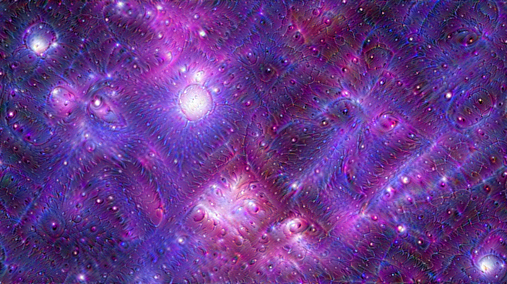
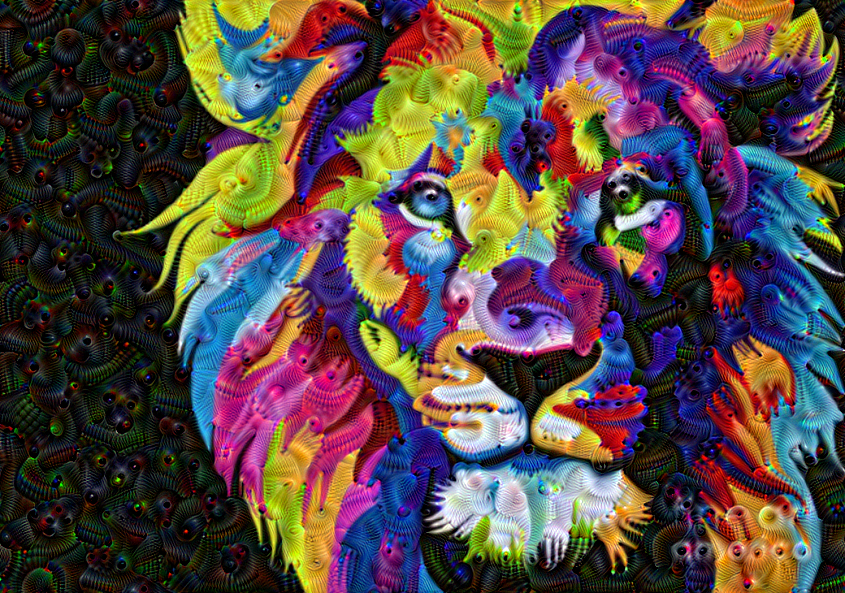

# DeepDream
Minimal implementation of DeepDream algorithm originally created by Alexander Mordvintsev to produce Dream-like hallucinogenic Images.
The idea in DeepDream is to choose a layer (or layers) and maximize the "loss" in a way that the image increasingly "excites" the layers.
The model used is **InceptionV3**.

# Results

